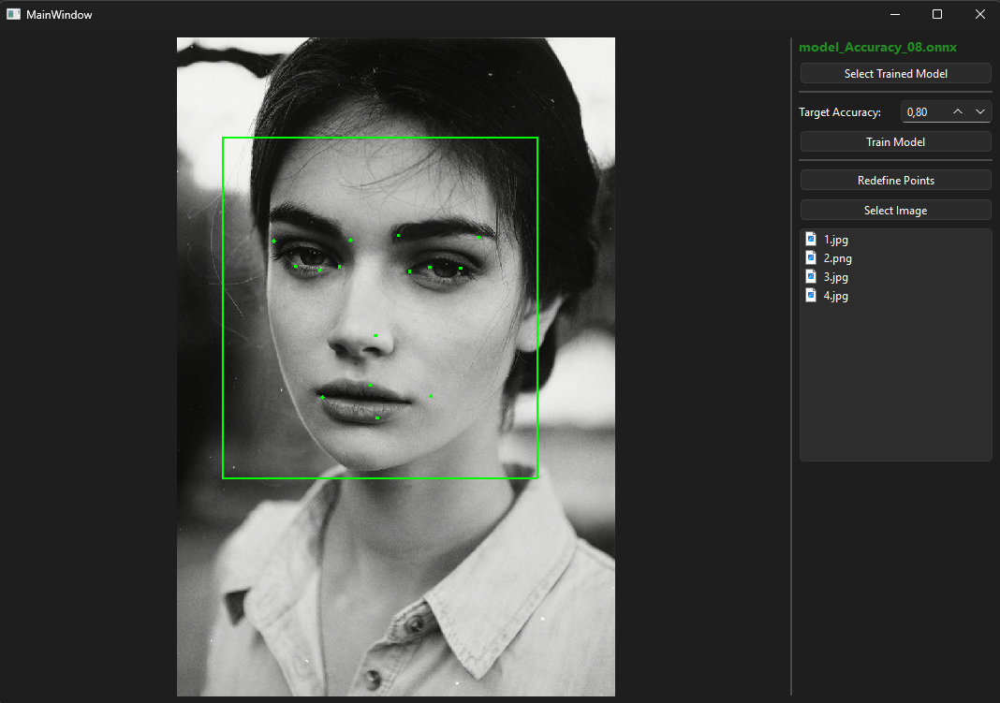
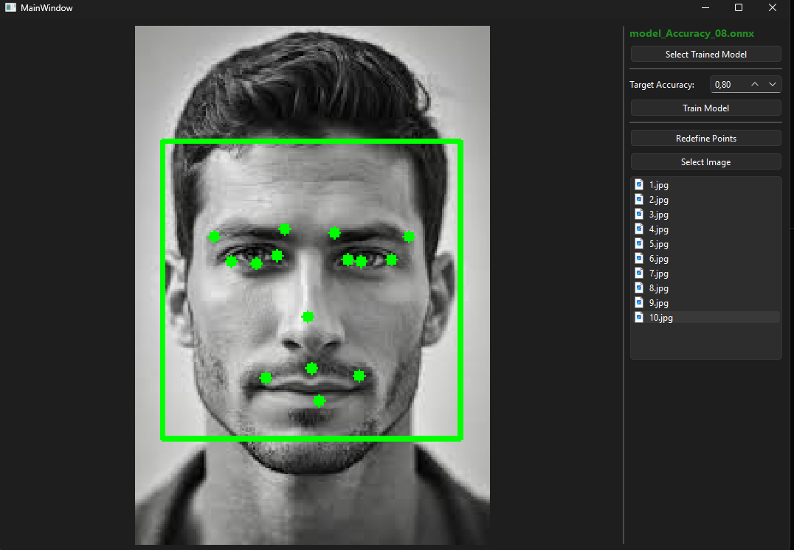
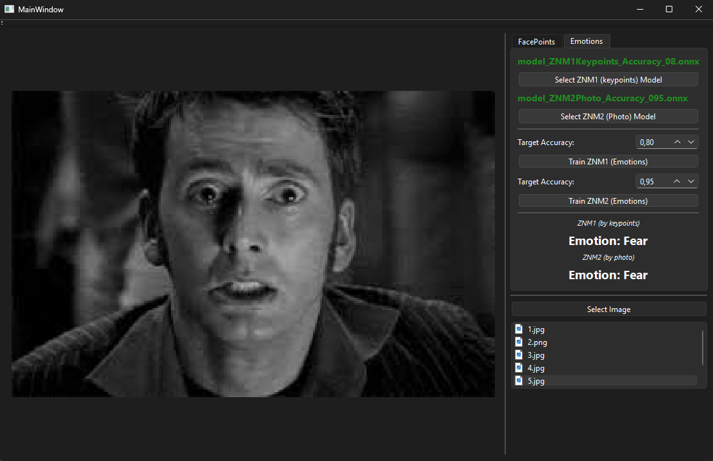

# Facial Keypoints & Emotion Recognition (C++ / Qt / OpenCV)

Програмний комплекс для автоматичного визначення 15 ключових анатомічних точок на зображенні обличчя людини, а також подальшої класифікації 7 базових емоцій. Проект розроблено в рамках лабораторних робіт з використанням згорткових нейронних мереж (CNN), класичних багатошарових перцептронів (MLP) та алгоритмів комп'ютерного зору.

## Особливості проекту
* **Двоетапний пайплайн (Two-stage Pipeline):** Автоматичний пошук обличчя на фотографії за допомогою каскадів Хаара (OpenCV) з подальшою передачею нормалізованого зображення у нейромережу.
* **Розпізнавання емоцій за точками (ЗНМ1):** Нейромережевий аналіз міміки, що базується виключно на 30 знайдених координатах ключових точок (із застосуванням Batch Normalization та Dropout для захисту від шуму).
* **Розпізнавання емоцій за пікселями (ЗНМ2):** Незалежна згорткова нейромережа (CNN), яка класифікує емоції безпосередньо по обрізаному зображенню обличчя (48x48 пікселів).
* **Вбудований модуль навчання:** Можливість тренувати моделі ЗНМ1 та ЗНМ2 безпосередньо з графічного інтерфейсу C++ (автоматичний запуск Python-скриптів `train_znm1.py` та `train_znm2.py` через `QProcess` із відображенням прогресу).
* **Кросплатформний GUI:** Зручний користувацький інтерфейс, написаний на фреймворку Qt, із розділенням логіки по вкладках.

## Скріншоти роботи програми

---

## Запуск готової програми (Рекомендовано)
Якщо ви хочете просто протестувати програму без встановлення компіляторів та бібліотек:
1. Перейдіть у розділ **[Releases](../../releases)** збоку на цій сторінці.
2. Завантажте останній `.zip` архів з програмою.
3. Розархівуйте його у будь-яку зручну теку.
4. Запустіть `.exe` файл. Всі необхідні моделі та `.dll` файли вже знаходяться всередині!

---

## Збірка з вихідних кодів (Для розробників)

**Вимоги:**
* Qt Creator (Qt 6+)
* CMake та компілятор (MSVC 2022 або MinGW 64-bit)
* OpenCV (з налаштованими шляхами у `CMakeLists.txt`)
* Python 3.x (для запуску скриптів навчання)

**Кроки для розгортання:**
1. Клонуйте репозиторій: `git clone https://github.com/Ваш_Нік/Ваш_Репозиторій.git`
2. Для роботи з даними або перенавчання моделі встановіть Python-залежності:
   `pip install opencv-python pandas numpy torch torchvision`
3. Відкрийте файл `CMakeLists.txt` через Qt Creator.
4. Переконайтеся, що файли навчених моделей (`.onnx`), `haarcascade_frontalface_default.xml` та Python-скрипти знаходяться у робочій директорії збірки (або скопіюйте їх туди вручну).
5. Зберіть проект у режимі **Release** або **Debug**.

> **Примітка:** Інструменти для роботи з датасетом (парсинг, злиття, ручна розмітка, генерація вибірки емоцій) знаходяться в окремій теці `dataset_tools`. Детальна інструкція до них описана у локальному README файлі цієї теки.