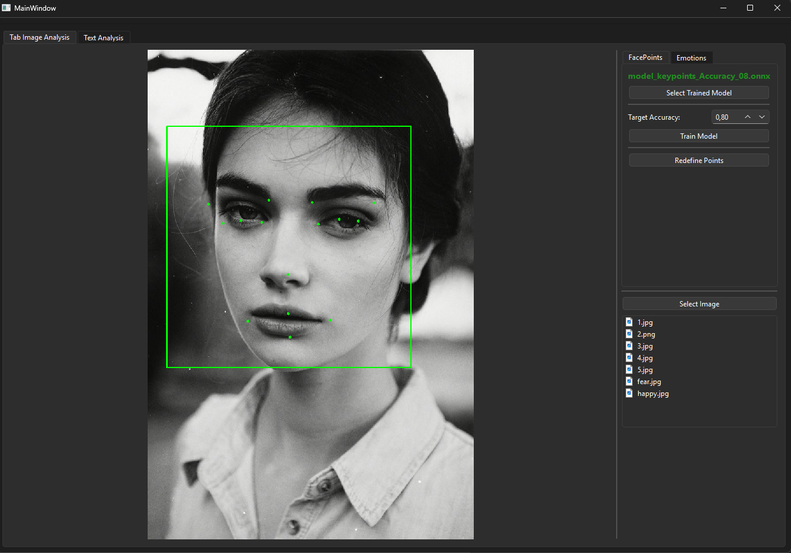
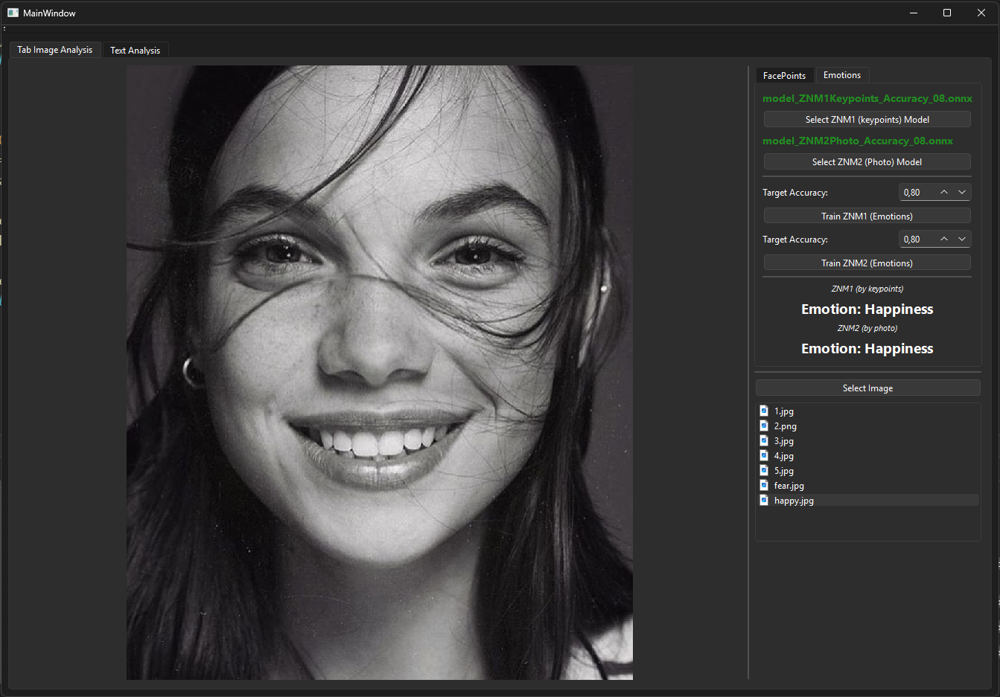
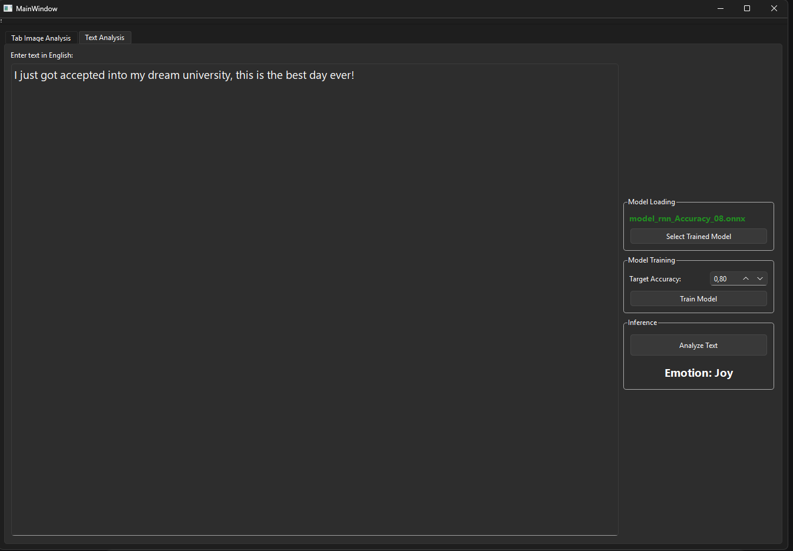

# AI Processing Toolkit: Computer Vision & NLP (C++ / Qt / PyTorch)

Мультимодальний програмний комплекс, розроблений для вирішення задач комп'ютерного зору (аналіз обличчя) та обробки природної мови (класифікація тексту). Проект використовує комбінацію згорткових (CNN), багатошарових (MLP) та рекурентних (RNN/LSTM) нейронних мереж, об'єднаних єдиним кросплатформним графічним інтерфейсом на базі Qt.

## Особливості проекту
* **Аналіз обличчя (Face Analysis):**
  * **Двоетапний пайплайн:** Автоматичний пошук обличчя на фотографії за допомогою каскадів Хаара (OpenCV) з подальшою передачею нормалізованого зображення у нейромережу.
  * **Детекція ключових точок:** Визначення 15 анатомічних точок обличчя (30 координат) за допомогою згорткової нейромережі.
  * **Розпізнавання емоцій за точками (ЗНМ1):** Нейромережевий аналіз міміки, що базується виключно на знайдених координатах ключових точок.
  * **Розпізнавання емоцій за пікселями (ЗНМ2):** Незалежна згорткова нейромережа, яка класифікує емоції безпосередньо по обрізаному зображенню обличчя (48x48).
* **Аналіз тексту (NLP - Text Emotion):**
  * **Рекурентна нейромережа (LSTM):** Класифікація англомовного тексту на 6 базових емоцій (Joy, Sadness, Anger, Fear, Love, Surprise).
  * **Динамічна токенізація:** Автоматична генерація та підключення словника (`vocab_rnn.json`) для перетворення тексту у тензорний формат безпосередньо в оперативній пам'яті.
* **Вбудований модуль навчання:** Можливість тренувати будь-яку з моделей безпосередньо з графічного інтерфейсу C++ (автоматичний запуск Python-скриптів через `QProcess` із відображенням прогресу навчання).
* **Модульний GUI:** Зручний користувацький інтерфейс, написаний на C++ Qt, із логічним розділенням робочих просторів (Image Analysis / Text Analysis) через вкладки.

## Скріншоти роботи програми

**Детекція ключових точок обличчя:**

**Двофакторне розпізнавання емоцій (ЗНМ1 та ЗНМ2):**

**NLP: Розпізнавання емоційного забарвлення тексту (LSTM):**

---

## Запуск готової програми (Рекомендовано)
Якщо ви хочете просто протестувати програму без встановлення компіляторів та бібліотек:
1. Перейдіть у розділ **[Releases](../../releases)** збоку на цій сторінці.
2. Завантажте останній `.zip` архів з програмою.
3. Розархівуйте його у будь-яку зручну теку.
4. Запустіть `.exe` файл. Всі необхідні моделі (`.onnx`), словники (`.json`) та `.dll` файли вже знаходяться всередині!

---

## Збірка з вихідних кодів (Для розробників)

**Вимоги:**
* Qt Creator (Qt 6+)
* CMake та компілятор (MSVC 2022 або MinGW 64-bit)
* OpenCV (з налаштованими шляхами у `CMakeLists.txt`)
* Python 3.10+ (для запуску скриптів навчання)

**Кроки для розгортання:**
1. Клонуйте репозиторій: `git clone https://github.com/Ваш_Нік/Ваш_Репозиторій.git`
2. Встановіть необхідні Python-залежності для роботи з нейромережами та даними:
   `pip install opencv-python pandas numpy torch torchvision datasets`
3. Відкрийте файл `CMakeLists.txt` через Qt Creator.
4. Переконайтеся, що файли навчених моделей (`.onnx`), `vocab_rnn.json`, `haarcascade_frontalface_default.xml` та Python-скрипти знаходяться у робочій директорії збірки (або скопіюйте їх туди вручну).
5. Зберіть проект у режимі **Release** або **Debug**.

> **Примітка:** Інструменти для роботи з датасетами (парсинг, злиття, ручна розмітка, генерація вибірки емоцій, завантаження текстових NLP датасетів) знаходяться в окремій теці `dataset_tools`. Детальна інструкція до них описана у локальному `README.md` файлі цієї теки.